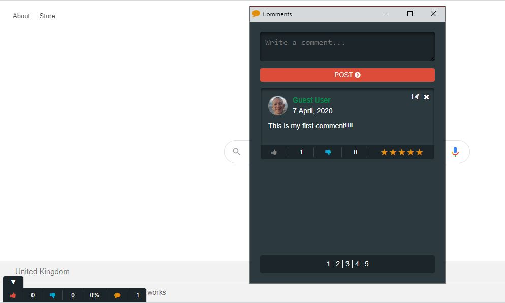
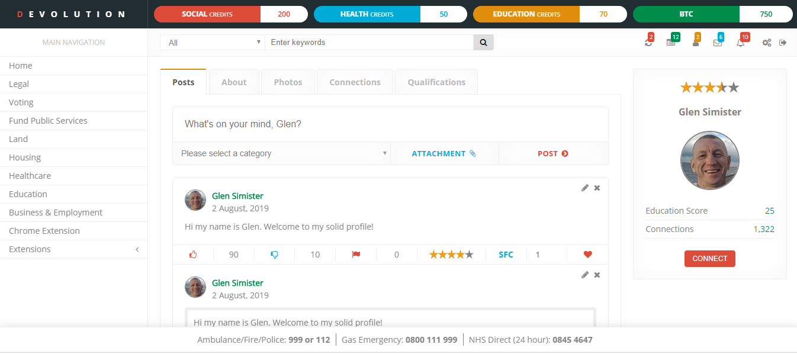

<h1>DVO</h1>

What is DVO?

DVO is a browser extension which serves as a universal API for governance applications. It is similar to MetaMask in that it acts as a bridge between various extensions and applications, and the underlying technologies, such as GunDB, Solid, Etherum, and so on.

Click <a href="https://glensimister.github.io/profile/">here</a> for a more detailed explaination (although the idea has evolved since)

The toolbar allows users to like, dislike and comment on any URL.

The screenshot below uses the DVO API extension and the Toolbar extension (see above)

DVO will provide the API for Devolution - a decentralized governance model (screenshot below)

